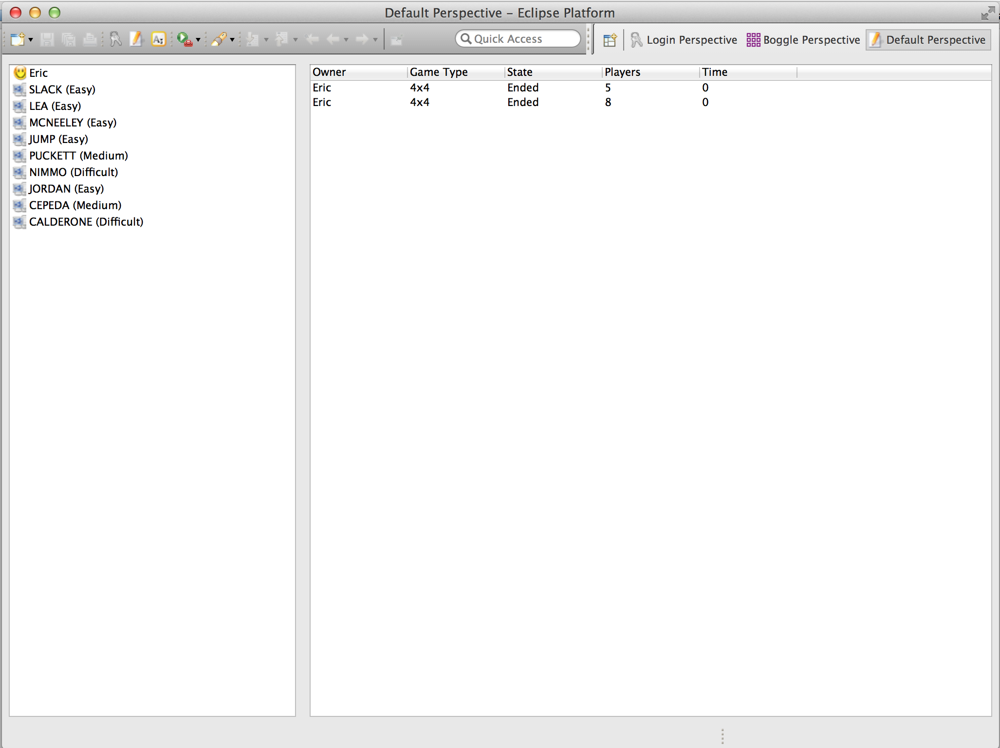
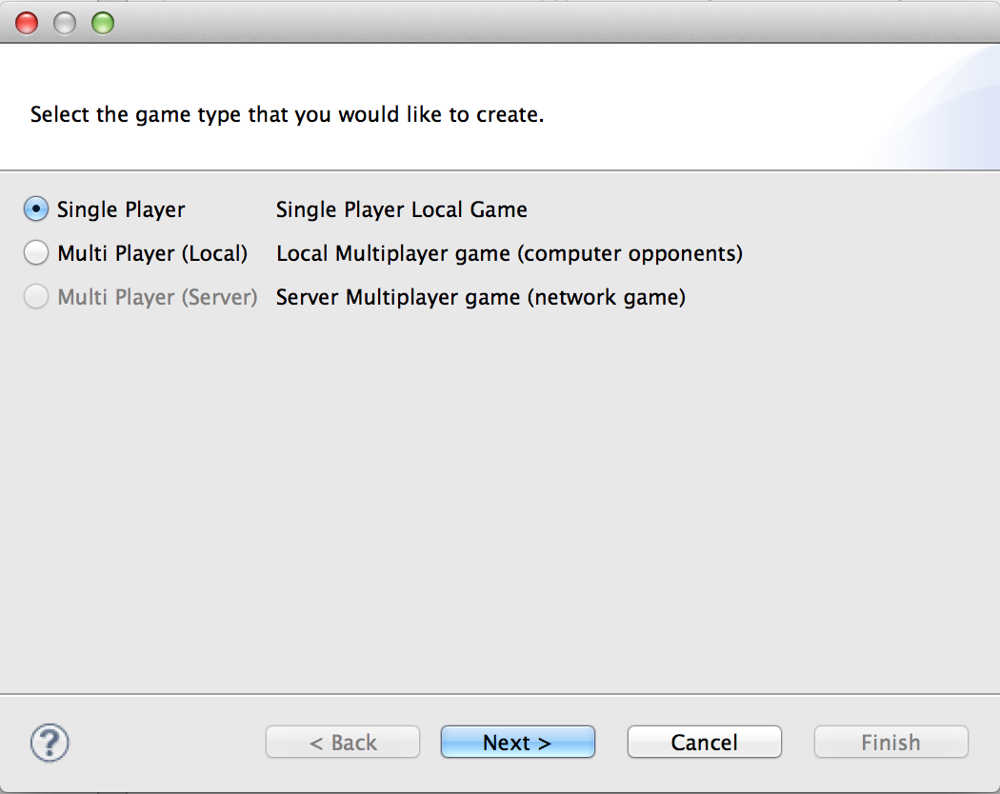
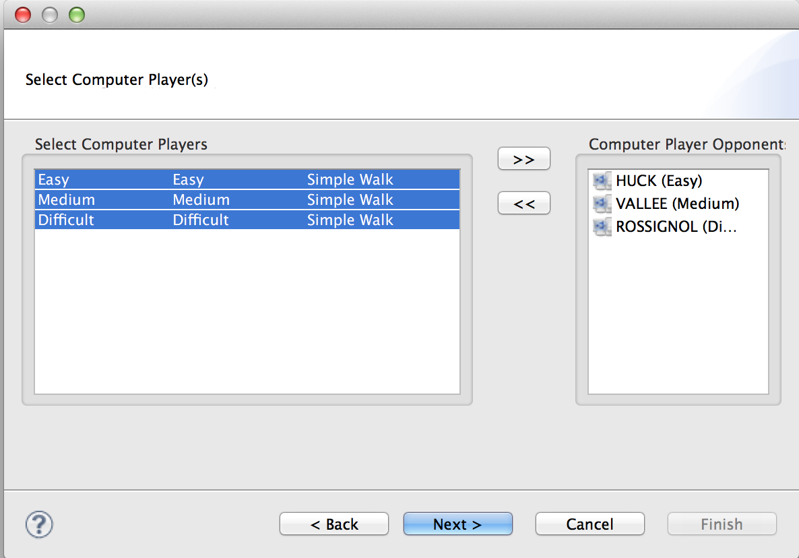
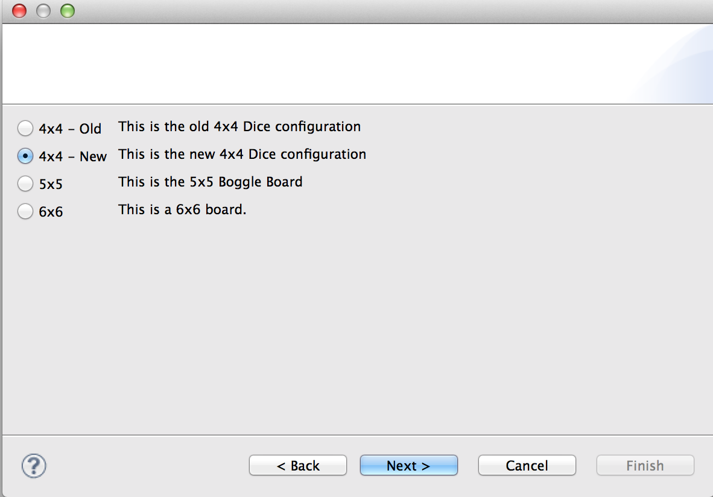
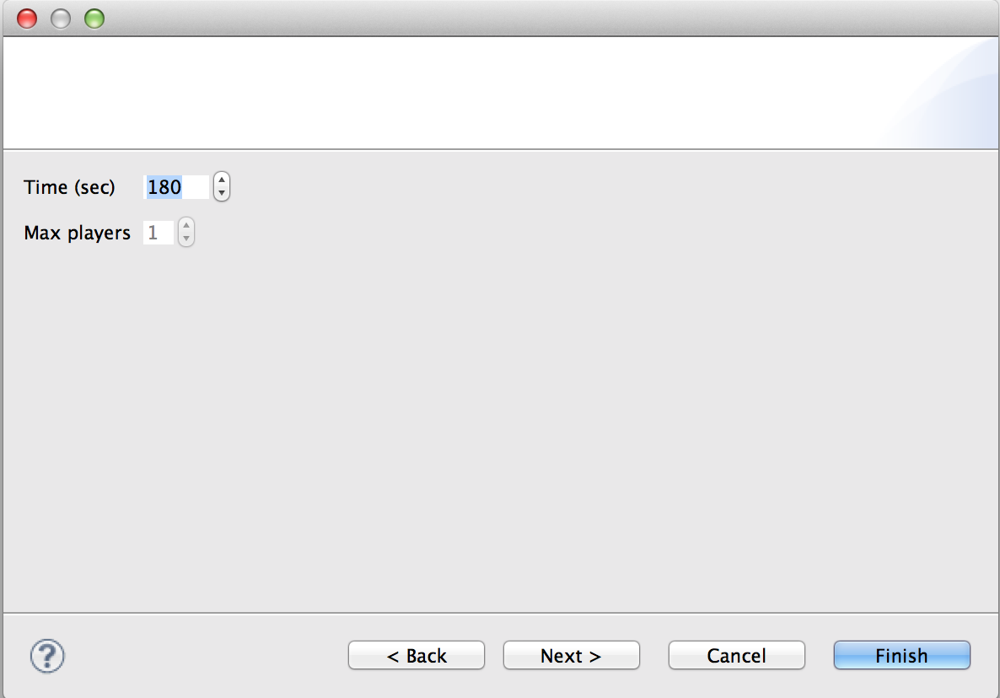
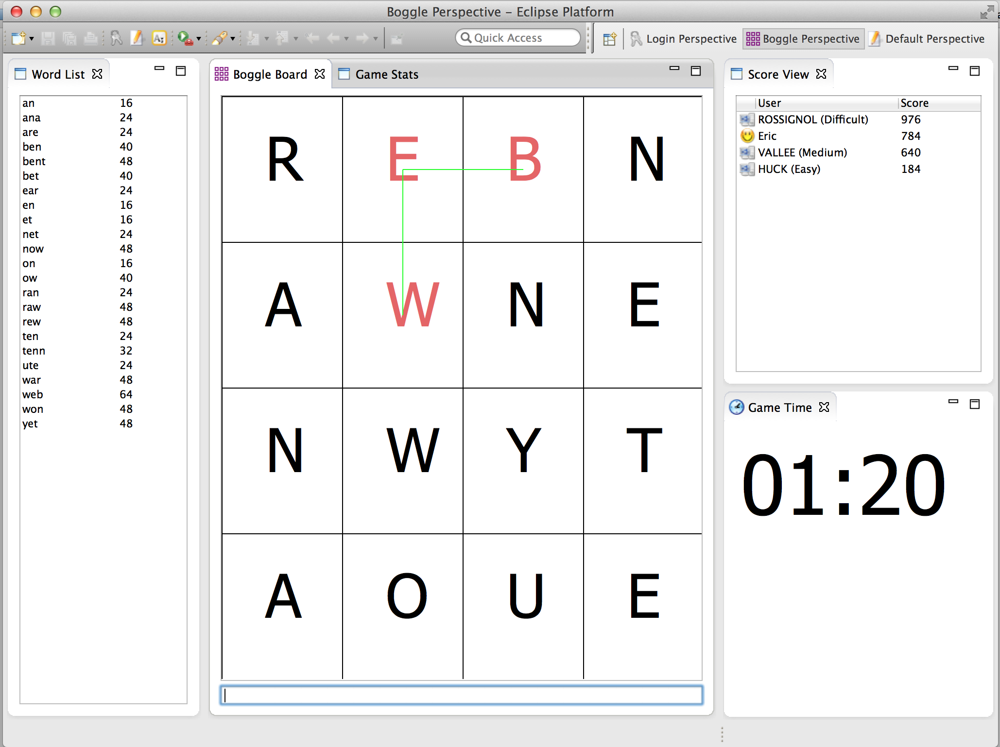
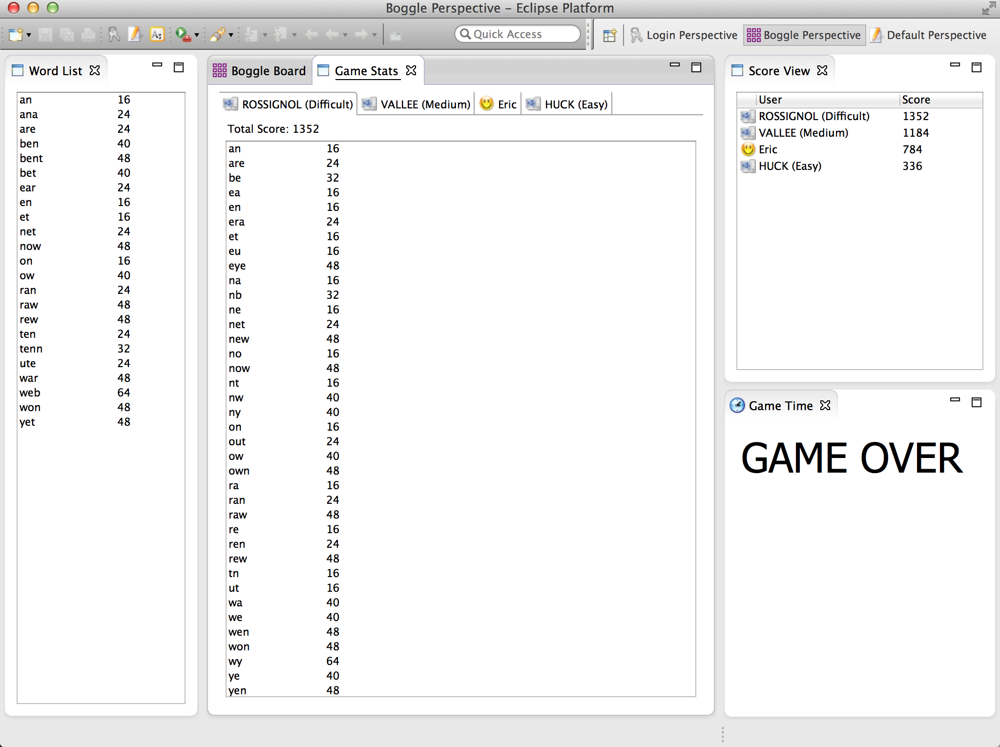

# boggle-rcp
Eclipse RCP Version of Boggle.  It's multi-player with computer players.  There is plenty of work to be done on it, however it's pretty slick.

Yep - it's old, it uses XML.  It *should* be using JSON.  I've got code generators to help out with that...

## Setup
Import all of the projects into Eclipse (RCP).

## Screenshots

### Default Perspective

### New Game

### Game Play

### Game Over

